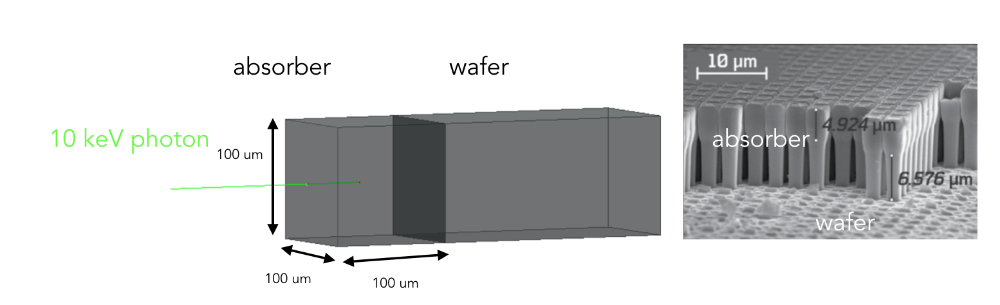

 Allpix-squared is a generic pixel detector framework based on geant4. More details: https://cern.ch/allpix-squared/

Work in progress. Downloaded from https://gitlab.cern.ch/allpix-squared/allpix-squared and added a first detector geometry: example_latenium.conf

example_latenium.conf is located in the example/ folder. 
It reads a detector geometry driver example_detector_lat.conf which reads another file located in models/latenium.conf. 
latenium.conf contains all the details on the detector geometry. 

For now the detector consists of a simple 100x100x100 micron asborber direclty bonded on a Silicon wafer. 
The absorber is Silicon, needs to be updated to Ge (can only be done in the source code). A 10 keV photon is shot on the absorber.
The activation/de-activion of the visulation is performed at the end of the example_latenium.conf file (self-explanatory in the file)
The number of carriers created at each photon interaction is written out on the terminal

requires ROOT and Geant4 installed

$ git clone https://gitlab.ethz.ch/G-Ray/Allpix-squared.git

$ cd Allpix-squared

$ mkdir build && cd build/

$ source $G4INSTALL/bin/geant4.sh (if Geant4 env. not set)

$ cmake ..

$ make -jN install (N number of proc.)

$ cd ..

$ bin/allpix -c examples/example_latenium.conf
